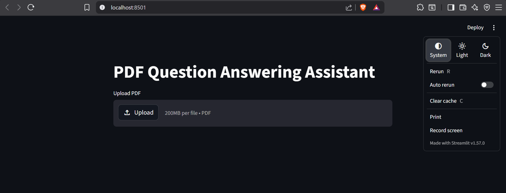
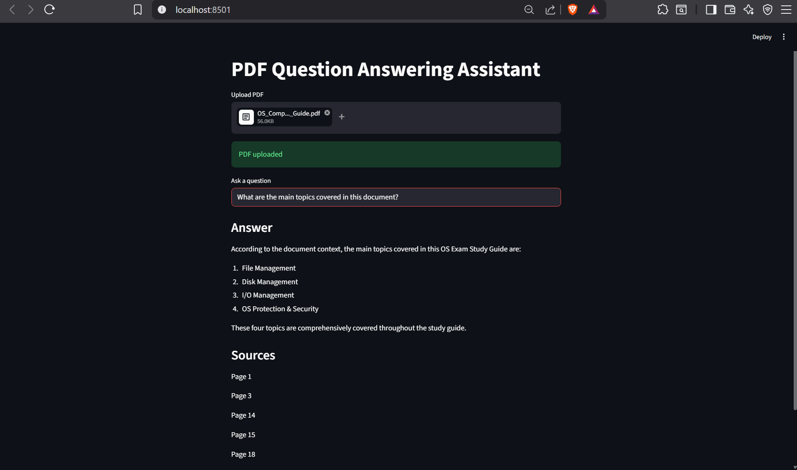

# PDF Question Answering Assistant

An end-to-end Retrieval-Augmented Generation (RAG) application for querying PDF documents using semantic search and local LLM inference.

---

## Features

- Upload and process PDF documents
- Extract and chunk document text
- Generate vector embeddings using Sentence Transformers
- Store embeddings using FAISS vector database
- Perform semantic similarity retrieval
- Generate context-aware answers using Llama 3 via Ollama
- Display source page references

---

## Tech Stack

- Python
- Streamlit
- FAISS
- Sentence Transformers
- Ollama
- Llama 3
- LangChain Text Splitters

---

## Pipeline

PDF Upload → Text Extraction → Chunking → Embedding Generation → Vector Search → Context Retrieval → LLM Response Generation

---

## Demo

### Application UI



### Question Answering Example



---

## Run Locally

```bash
git clone https://github.com/asthasinghcs/pdf-rag-assistant.git

cd pdf-rag-assistant

python -m venv venv

venv\Scripts\activate

pip install -r requirements.txt

streamlit run app/main.py
```

---

## Local LLM Setup

Install Ollama:

https://ollama.com/download

Then run:

```bash
ollama run llama3
```

---

## Project Structure

```text
app/
├── main.py
├── pdf_processor.py
├── chunking.py
├── embeddings.py
├── vector_store.py
├── retriever.py
├── prompts.py
└── llm.py
```

---

## Architecture

PDF Upload  
↓  
Text Extraction  
↓  
Chunking  
↓  
Embedding Generation  
↓  
FAISS Vector Storage  
↓  
Semantic Retrieval  
↓  
LLM Response Generation

---

## Future Improvements

- Hybrid search (BM25 + vector retrieval)
- Chat memory
- Multi-PDF support
- Metadata filtering
- Better reranking pipeline
- Deployment support